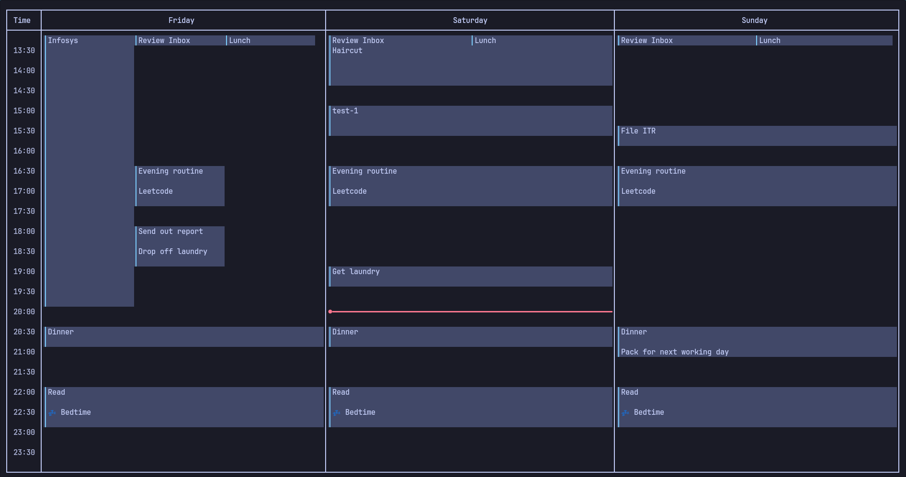

# GCAL TUI

## Disclaimer

- This project is still in experimental stage

### TODO

- [ ] Write Docs
- [ ] Write Tests
- [ ] Add help for keybinds
- [ ] Support multiple calendars
- [ ] Show multi modal status

## Installation

- `cargo install --locked j-gcal`

## Keybinds

- Supports vim keybinds
- Starts out in normal mode

## Normal mode

- `hjkl` to scroll

## Insert mode

- `hjkl` to move the new event
- `enter` to enter details about the new event
- `control + s` to save the new event

## Visual mode

- `hjkl` to select the next and prev events
- `enter` to edit the selected event
- `control + s` to save the edits
- `d` to delete events
